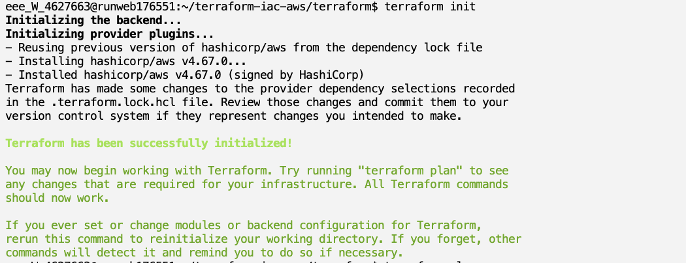
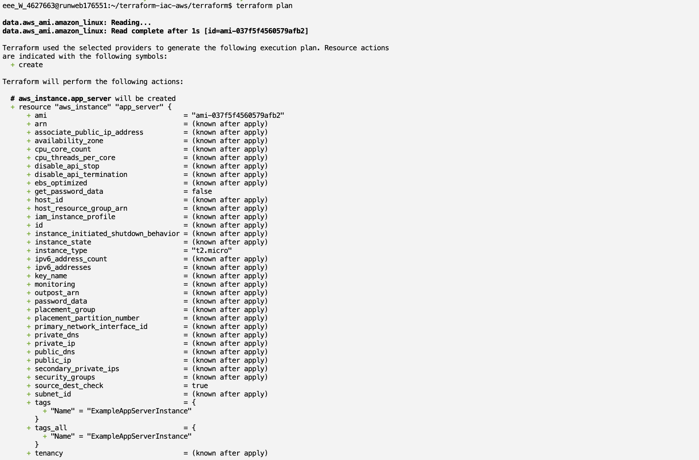
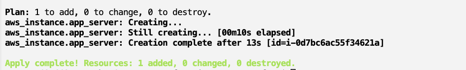
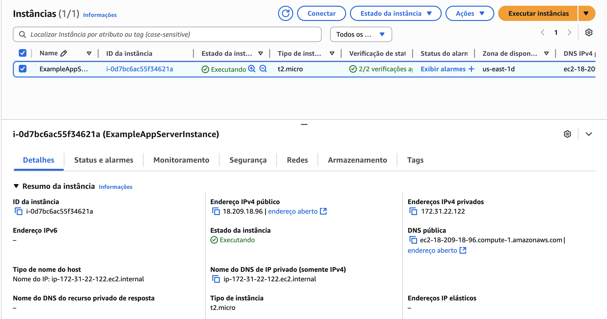

# Terraform IaC AWS

Neste projeto, utilizei o Terraform para automatizar o provisionamento de recursos na AWS, seguindo o conceito de Infraestrutura como Código (IaC). O objetivo principal foi criar, de forma reprodutível e versionada, uma instância EC2 com apenas algumas linhas de código, demonstrando as etapas essenciais do fluxo de trabalho.

## Pré-requisitos

Antes de começar, é necessário ter instalado e configurado:

* **Conta AWS** com permissões para criar instâncias EC2.
* **AWS CLI** configurado via `aws configure` ou variáveis de ambiente no AWS Academy Lab.
* **Terraform CLI** (versão >= 1.0) instalado e disponível no seu `PATH`.

```bash
terraform -v  # deve exibir sua versão do Terraform
aws sts get-caller-identity  # confirma suas credenciais AWS
```

## Estrutura do repositório

```
terraform-iac-aws/
├── images/           # Capturas de tela do init, plan e apply
│   ├── init.png
│   ├── plan-summary.png
│   ├── plan-block.png
│   └── apply.png
├── terraform/        # Código principal do Terraform
│   ├── main.tf
│   ├── variables.tf
└── README.md         # Este arquivo de documentação
```

## Passo a passo


### 1. Clonar o repositório

```bash
git clone git@github.com:claramohammad/terraform-iac-aws.git
cd terraform-iac-aws
```

Cria uma cópia local do projeto e prepara a estrutura para os próximos passos.

### 2. Definir o provider AWS

Em `terraform/main.tf`, especifiquei o provedor e sua versão mínima:

```hcl
terraform {
  required_providers {
    aws = {
      source  = "hashicorp/aws"
      version = "~> 4.0"
    }
  }
}

provider "aws" {
  region = var.aws_region
}
```

Em `terraform/variables.tf`, defini a variável de região:

```hcl
variable "aws_region" {
  description = "Região AWS para provisionamento"
  type        = string
  default     = "us-east-1"
}
```

É importante separar configurações de provedor e variáveis para tornar o código mais flexível e reutilizável entre diferentes ambientes.

### 3. Iniciar o Terraform

```bash
cd terraform
terraform init
```

Baixa os plugins do provedor AWS e configura o diretório de trabalho.



### 4. Visualizar plano de execução

```bash
terraform plan
```

O plan compara o estado atual (vazio) com a configuração e mostra o conjunto de ações que serão executadas. Ele revela quantos recursos serão adicionados, alterados ou destruídos.


**Bloco de criação do recurso:** detalha o recurso `aws_instance.app_server` que será provisionado.



### 5. Aplicar o plano e provisionar

```bash
terraform apply -auto-approve
```

Provisiona automaticamente a instância EC2 sem necessidade de confirmação manual.



## Recursos provisionados



## Considerações finais

Durante esta atividade, compreendi que adotar um fluxo de trabalho de IaC estruturado traz benefícios significativos: a definição declarativa de providers e variáveis assegura padronização e clareza, a inicialização do Terraform sincroniza dependências e plugins, a revisão detalhada do plano previne alterações inesperadas e a aplicação controlada consolida o ambiente de forma segura. Este processo reduz erros manuais, mantém um histórico de auditoria completo em sistemas de controle de versão, facilita a colaboração e permite replicar ambientes idênticos em diferentes estágios.